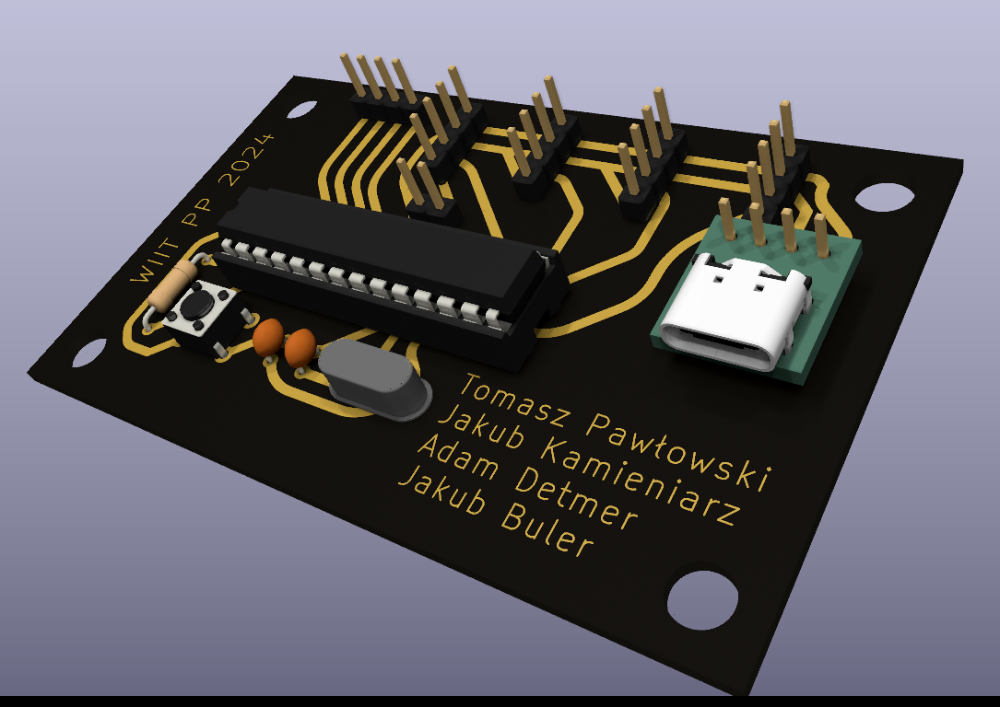
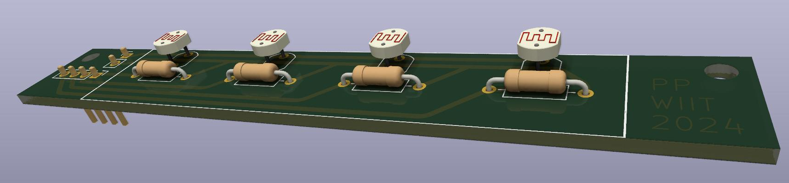
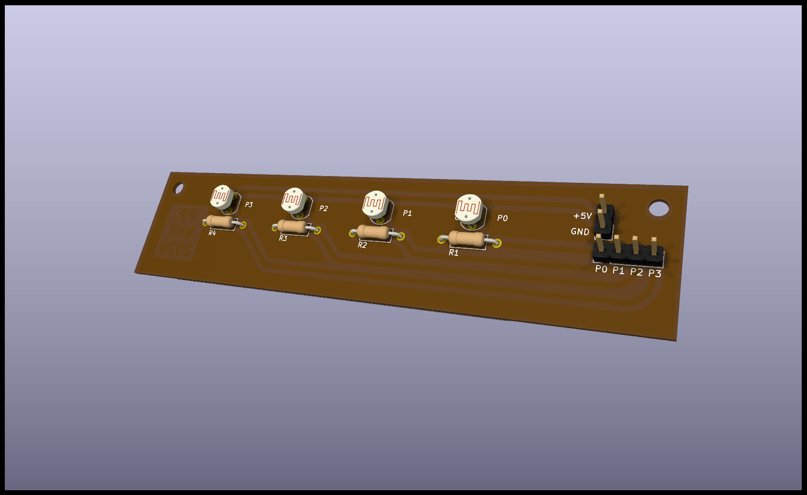
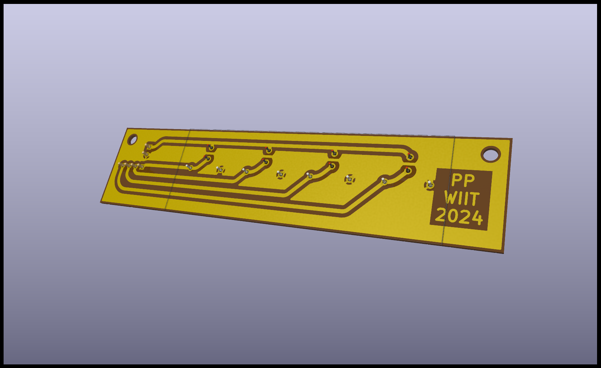
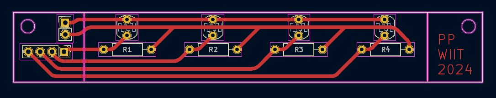
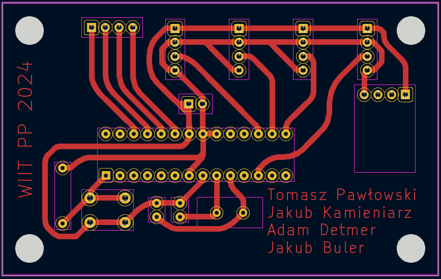
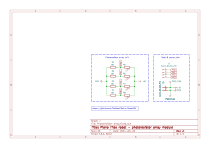
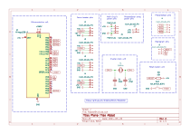

# Robot ASK - Piano tiles

A Piano Tiles (mobile game) hardware autoclicker built on the ATmega328. All electrical sketches and the PCB were designed in [KiCad](https://www.kicad.org/). Code for the microprocessor was written in C++ using Arduino and Servo libraries as well as the [PlatformIO](https://platformio.org/install/ide?install=vscode) VSCode extension.

This project also has a live visualisation Python script that communicates with the main board over serial to display data captured by the photoresistor module. This script can also be used to quickly adjust some parameters at the start of runtime.

This repository was created for a university group project for [RoboDay 2024](https://www.facebook.com/events/1518830758974874) at Poznań University of Technology.
Made by: Tomasz Pawłowski, Jakub Kamieniarz, Jakub Buler, Adam Deter  

