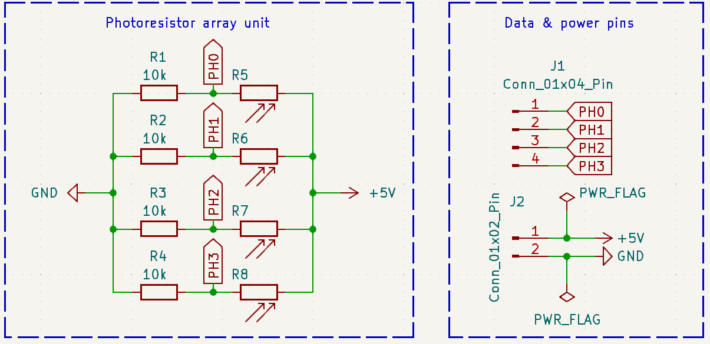
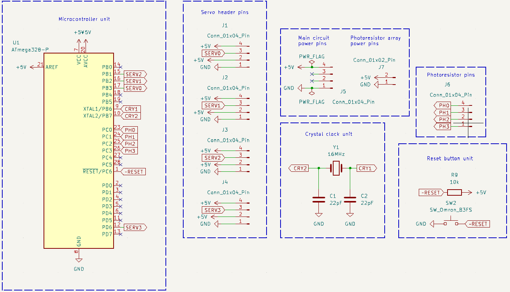

# Robot ASK - Piano tiles
---
[Rozszerzenie do VSCode](https://platformio.org/install/ide?install=vscode)

[Platform.io Arduino debugging](https://docs.platformio.org/en/latest//tutorials/espressif32/arduino_debugging_unit_testing.html)

